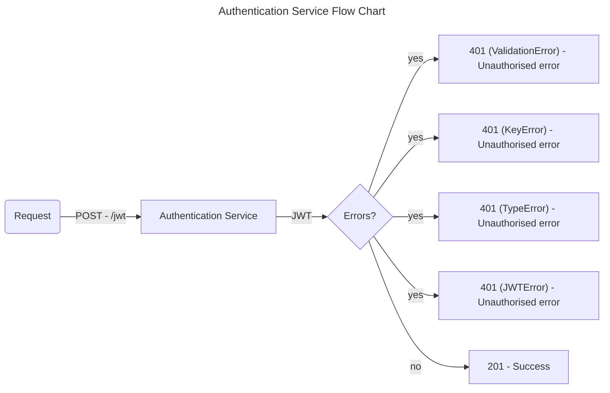
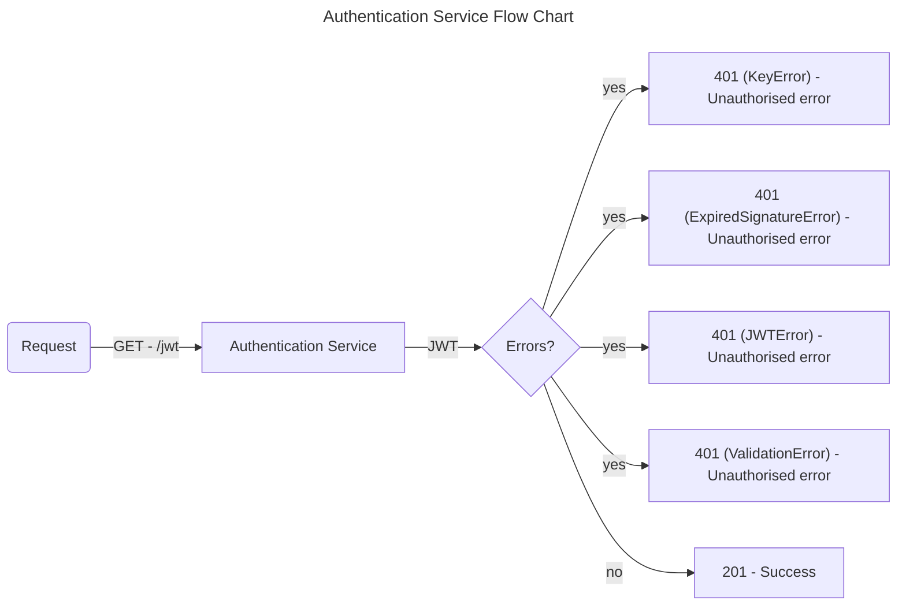

```mermaid
---
title: Authentication Service Flow Chart
---

flowchart LR
    HttpRequest(Request) -->|POST - /jwt| AuthenticationService[Authentication Service]
    AuthenticationService -->|JWT| Errors{Errors?}
    Errors -->|yes| ValidationError["401 (ValidationError) - Unauthorised error"]
    Errors -->|yes| KeyError["401 (KeyError) - Unauthorised error"]
    Errors -->|yes| TypeError["401 (TypeError) - Unauthorised error"]
    Errors -->|yes| JWTError["401 (JWTError) - Unauthorised error"]
    Errors -->|no| SuccessResponse[201 - Success]
```

```mermaid
---
title: Authentication Service Flow Chart
---

flowchart LR
    HttpRequest(Request) -->|GET - /jwt| AuthenticationService[Authentication Service]
    AuthenticationService -->|JWT| Errors{Errors?}
    Errors -->|yes| KeyError["401 (KeyError) - Unauthorised error"]
    Errors -->|yes| ExpiredSignatureError["401 (ExpiredSignatureError) - Unauthorised error"]
    Errors -->|yes| JWTError["401 (JWTError) - Unauthorised error"]
    Errors -->|yes| ValidationError["401 (ValidationError) - Unauthorised error"]
    Errors -->|no| SuccessResponse[201 - Success]
```
