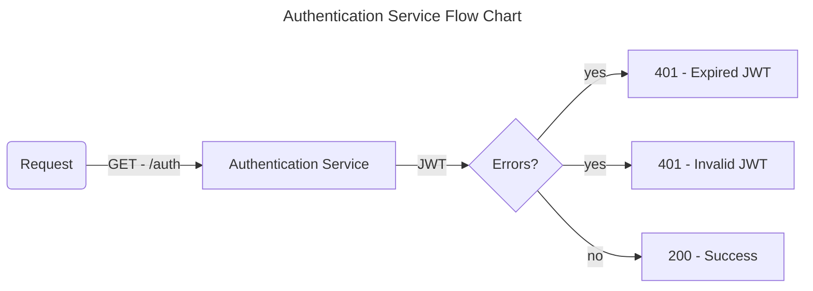

```mermaid
---
title: Authentication Service Flow Chart
---

flowchart LR
    HttpRequest(Request) -->|GET - /auth| AuthenticationService[Authentication Service]
    AuthenticationService -->|JWT| Errors{Errors?}
    Errors -->|yes| ExpiredJwtResponse[401 - Expired JWT]
    Errors -->|yes| InvalidJwtResponse[401 - Invalid JWT]
%%    Errors -->|yes| UserDoesNotExistResponse[401 - User Does Not Exist]
%%    Errors -->|yes| UserAccountDisabledResponse[401 - User Account Disabled]
    Errors -->|no| SuccessResponse[200 - Success]
```
