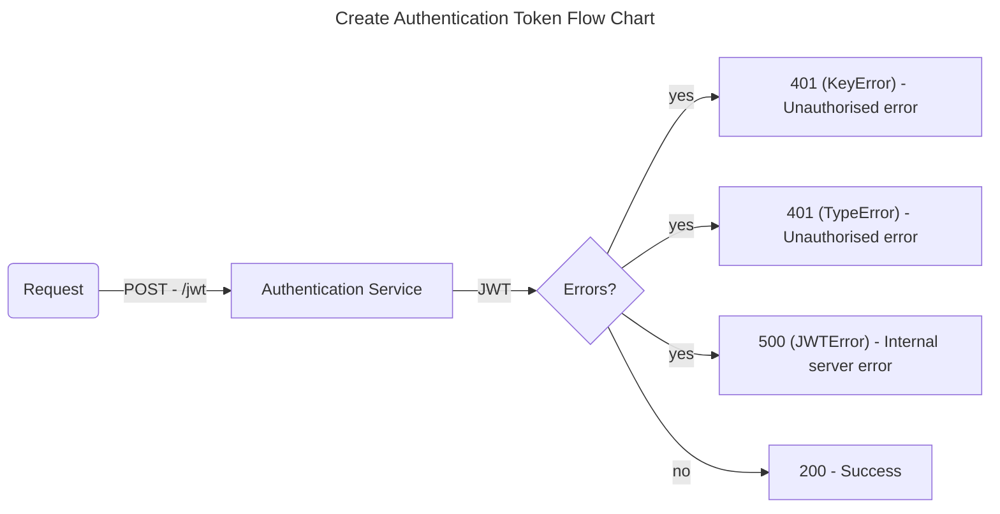
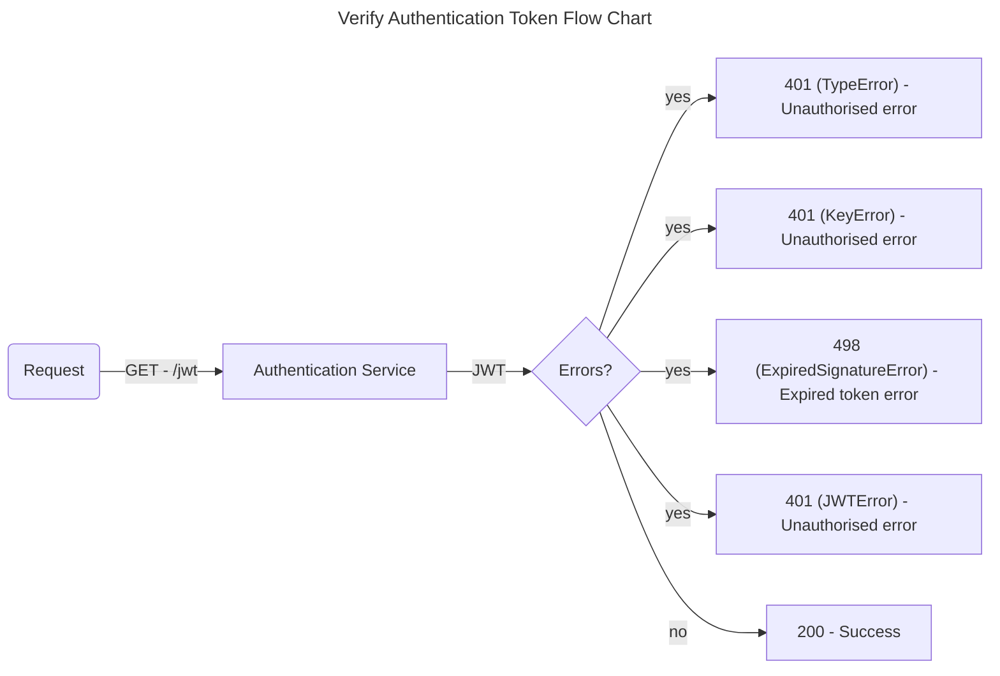

```mermaid
---
title: Create Authentication Token Flow Chart
---

flowchart LR
    HttpRequest(Request) -->|POST - /jwt| AuthenticationService[Authentication Service]
    AuthenticationService -->|JWT| Errors{Errors?}
    Errors -->|yes| KeyError["401 (KeyError) - Unauthorised error"]
    Errors -->|yes| TypeError["401 (TypeError) - Unauthorised error"]
    Errors -->|yes| JWTError["500 (JWTError) - Internal server error"]
    Errors -->|no| SuccessResponse[200 - Success]
```

```mermaid
---
title: Verify Authentication Token Flow Chart
---

flowchart LR
    HttpRequest(Request) -->|GET - /jwt| AuthenticationService[Authentication Service]
    AuthenticationService -->|JWT| Errors{Errors?}
    Errors -->|yes| TypeError["401 (TypeError) - Unauthorised error"]
    Errors -->|yes| KeyError["401 (KeyError) - Unauthorised error"]
    Errors -->|yes| ExpiredSignatureError["498 (ExpiredSignatureError) - Expired token error"]
    Errors -->|yes| JWTError["401 (JWTError) - Unauthorised error"]
    Errors -->|no| SuccessResponse[200 - Success]
```
